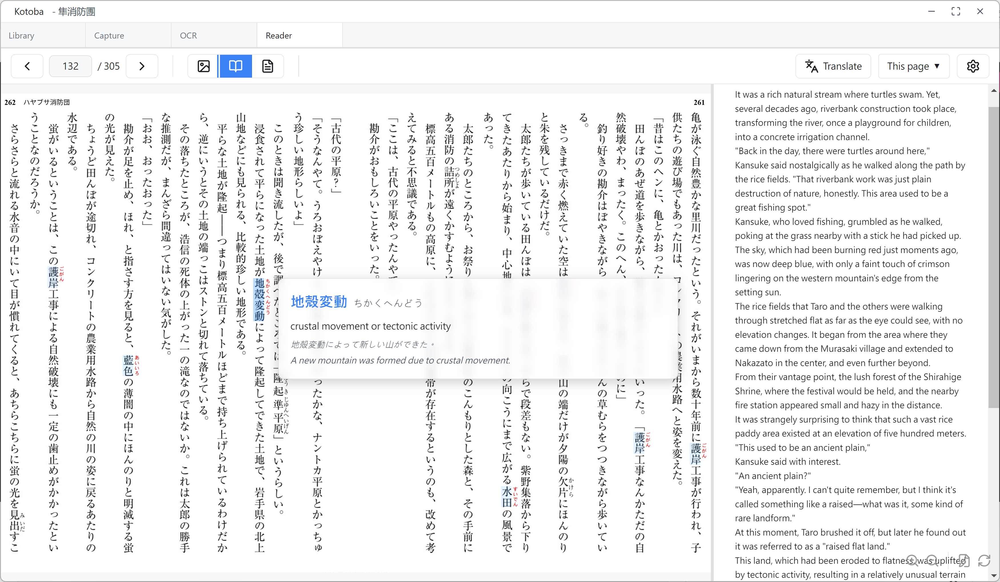

# Kotoba

> 📖 OCR Translation Reader for Foreign Novels

---

## 🎯 What is it?

**Kotoba** is a tool designed specifically for **reading foreign novels**. It uses screenshot + OCR to recognize e-book content, paired with AI translation and a smart vocabulary card system, making it easy to read Japanese, Chinese, English, and other foreign novels while learning the language.

**Who is it for?**
- 📚 E-book readers who purchased foreign novels and want to learn while reading
- 📖 Users who find e-reader learning features insufficient and need more powerful tools
- 💬 Language learners who want AI translation assistance and personalized vocabulary cards
- 🎌 Supports multiple languages with automatic text direction detection (vertical/horizontal)

---

## 📸 Screenshot



---

## ✨ Key Features

### 🔍 Multilingual OCR Recognition
- Supports multilingual text recognition
- Auto-handles multi-column layouts (two-column, magazine-style)
- **Exclusion Zone Feature**: Precisely filter out page numbers, headers, and other interference areas, completely solving the edge problem that traditional OCR cannot handle

### 🤖 Multi-LLM Translation
- Integrates OpenAI, Claude, Gemini, Grok AI services
- Customize translation style, character voices, and glossary
- Independent settings for each book to better suit your needs

### 📖 Smart Reading Modes
- **Image Mode**: View original image, hover to see vocabulary cards
- **Image+TL Mode**: Side-by-side image and translation
- **Text Mode**: OCR text + word list for easy text selection to add vocabulary cards
- Automatic vertical display for Chinese/Japanese, more natural reading
- Reading progress auto-saved, resume from last position

### 💬 AI Vocabulary Card System
- Auto-annotate pronunciation, translation, and example sentences via LLM
- Cross-book search and filtering support
- Export Anki decks for easy review in Anki

### 🎨 Complete Theme and Multilingual Interface
- Light / Dark / Follow System three themes
- Traditional Chinese / English bilingual interface
- No installation required, just extract and run

---

## 🚀 How to Use

### Step 1: Download & Install

**Choose one of two installation methods:**

#### Option A: Installer Version (Recommended)
1. Download `Kotoba-0.1.0-win-x64.exe`
2. Double-click to run the installer
3. Choose installation location, auto-launch after completion
4. Start Menu shortcut will be created

#### Option B: Portable Version
1. Download `Kotoba-0.1.0-win-x64.zip`
2. Extract to any folder (or USB drive)
3. Double-click `Kotoba.exe` to launch (no installation required)

**System Requirements**: Windows 10/11 (64-bit), 4GB RAM, 2GB disk space

### Step 2: Get Google Vision API Key (Required)

> This is the service used to recognize text on book pages. You need to apply for it yourself (free tier: 1,000 images per month)

1. Go to [Google Cloud Console](https://console.cloud.google.com/)
2. Create a new project or select an existing one
3. **Enable billing account** (Required, credit card needed even for free tier)
4. Enable "Cloud Vision API"
5. Create a service account and download JSON key file
6. Select the key file in Kotoba's "System Settings"

### Step 3: Set Up AI Translation (Optional)

If you need translation features, obtain an API key from any of these services:

- **OpenAI** (GPT-4 / GPT-3.5)
- **Anthropic Claude** (Sonnet / Haiku)
- **Google Gemini** (Gemini Pro)
- **xAI Grok**

Enter the key in "System Settings" → "AI Settings" to use.

---

## 📖 Basic Workflow

```
📚 1. Add a Book
    ↓
📸 2. Capture screenshots or drag and drop images
    ↓
🔍 3. Run OCR text recognition
    ↓
📖 4. Start reading
    ↓
🤖 5. Can't understand the page? Click "Translate" for full-page LLM translation
    ↓
💬 6. Found a new word? Select text in Text mode to add vocabulary card
    ↓
📤 7. Export Anki decks for easy review
```

**Detailed instructions**: See the included User Manual

---

## 🌐 Supported Languages

### Recognizable Book Languages

All languages supported by Google Vision (50+ languages)

### Translation Target Languages

Traditional Chinese · Simplified Chinese · English · Korean · Japanese · Spanish · German · French · Italian · Portuguese

### Interface Languages

Traditional Chinese · English

---

## ❓ FAQ

### Q: Windows shows a security warning on first run. What should I do?

This is normal because the software doesn't have a Microsoft code signing certificate. Follow these steps based on your system:

**Windows 10 / 11 - SmartScreen Warning**
1. When you see "Windows protected your PC" or "Microsoft Defender SmartScreen prevented an unrecognized app"
2. Click "More info"
3. Click "Run anyway"

**Windows 11 - Smart App Control (Stricter)**

If "Run anyway" is not available, Smart App Control is enabled:
1. Open Settings (Windows + I)
2. Go to Privacy & security → Windows Security → App & browser control
3. Click "Smart App Control settings"
4. Select "Off" (Note: Once turned off, you need to reset Windows to turn it back on)

**Alternative: Unblock the File**
1. Right-click on `Kotoba.exe` → Properties
2. At the bottom of the "General" tab, check "Unblock"
3. Click "Apply" → "OK"

### Q: Is it completely free?

**A**: The software itself is free, but you need to apply for Google Vision API (free tier: 1,000 images/month). AI translation requires a paid API key (optional).

### Q: Can I use it offline?

**A**: Text recognition (OCR) and AI translation require internet connection. Library management, reading, and vocabulary card features work offline.

### Q: What if I can't use the hotkey for screenshots?

**A**: You can use the drag-and-drop upload feature. First, use other screenshot tools (such as Windows' built-in Snipping Tool) to capture the book page, then drag the image to Kotoba's capture page.

### Q: What is the Exclusion Zone feature for?

**A**: Book pages often have page numbers, headers, footers, and other interference text in the margins. These areas are a nightmare for traditional OCR tools—they get mixed into the main text, disrupt reading order, and even cause translation errors. The Exclusion Zone feature lets you precisely mark these unwanted areas. The system automatically skips them during OCR, completely solving this problem.

---

## 📚 User Manual

For complete instructions, screenshots, and troubleshooting, see:

- 📘 **Traditional Chinese User Manual**: `Kotoba-Manual-zh-TW-v0.1.0.md`
- 📗 **English User Manual**: `Kotoba-Manual-en-v0.1.0.md`

---

## 💬 Need Help?

If you encounter issues, please refer to the complete user manual and FAQ section.

---

<div align="center">

**Kotoba** v0.1.0

Making foreign language reading easier 📚✨

[⬆️ Back to Top](#Kotoba)

</div>
